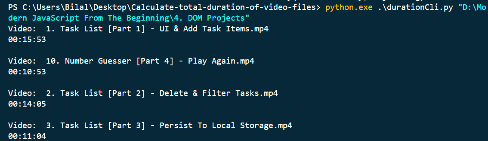

# Video Length Calculator

This is a Python project that calculates the total length of videos inside a folder given their file paths. It utilizes the `mimetypes` and `moviepy` libraries to extract video metadata and calculate the duration.

## Installation

1. Clone the repository to your local machine:

    
    `git clone https://github.com/BilalAhmed-358/Calculate-total-duration-of-video-files`
    

2. Navigate to the project directory:

    `cd Calculate-total-duration-of-video-files`


3. Install the required dependencies    using `pip`:

    `pip install -r requirements.txt`


## Usage

To calculate the total length of videos, run the `video_length_calculator.py` script and provide the file path as arguments.

`python video_length_calculator.py /path/to/folder`




Make sure to replace `/path/to/folder` with the actual folder path of the videos you want to calculate the length for.

## Output

The script will process each video file and display the duration of each video, as well as the total length of all videos combined.

``` Video: /path/to/video1.mp4
Duration: 00:10:30

Video: /path/to/video2.mkv
Duration: 00:05:45

Video: /path/to/video3.mov
Duration: 00:15:20

Total Length: 00:31:35 
```


## Contributing

Contributions are welcome! If you find any issues or have suggestions for improvements, please open an issue or submit a pull request on the [GitHub repository](https://github.com/BilalAhmed-358/Calculate-total-duration-of-video-files).


## Contact

If you have any questions or need further assistance, feel free to reach out to the project maintainer:

- Name: Bilal Ahmed Khan
- Email: ahmedkhanbilal358@gmail.com

Thank you for using the Video Length Calculator!